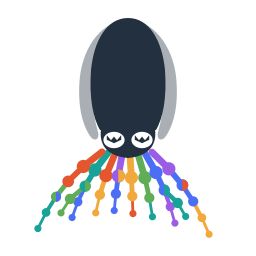

<p align="center">
  <picture>
    <source media="(prefers-color-scheme: dark)" srcset="website/src/assets/cuttlefish-logo-dark.svg">
    
  </picture>
</p>

<h1 align="center">Cuttlefish 3</h1>

Cuttlefish 3 constructs uncolored and colored compacted de Bruijn graphs from
sequencing reads or reference sequences. It is a parallel, external-memory
tool designed for collections that are too large to keep entirely in RAM —
it has built the colored graph of 150,000 bacterial genomes on a single
machine. This repository holds the Rust implementation, which is the canonical
and forward-looking implementation of Cuttlefish 3.

> **Version 3.0.0.** Feature-complete and validated on reference and read
> inputs, uncolored and colored, for odd k from 3 to 63. The major version
> tracks the product generation, so a backward-incompatible change to the
> outputs or the command line bumps the *minor* version and is called out in
> the [changelog](CHANGELOG.md).

## Installation

Prebuilt binaries for Linux and macOS (x86-64 and arm64) are attached to each
[GitHub release](https://github.com/COMBINE-lab/cuttlefish/releases), or via
[bioconda](https://bioconda.github.io/recipes/cuttlefish/README.html):

```bash
conda install -c bioconda cuttlefish
```

With a Rust toolchain (1.91 or newer), install from crates.io or build from
source:

```bash
cargo install cuttlefish-rs-cli
# tuned to the installing machine's CPU (fastest, not portable):
RUSTFLAGS="-C target-cpu=native" cargo install cuttlefish-rs-cli
```

```bash
git clone https://github.com/COMBINE-lab/cuttlefish.git
cd cuttlefish
cargo build --release   # binary at target/release/cuttlefish
```

## Usage

```bash
# uncolored compacted graph from references
cuttlefish build --ref --seq genome.fa -k 31 -t 16 -w work/ -o graph

# colored graph over a collection: each listed path is one source color
cuttlefish build --ref --list genomes.list -k 31 -t 32 -w work/ -o graph --color
```

The binary carries six commands: `build`, `compare`, `colors`
(`dump`/`sets`/`grep`), `cleanup`, `help`, and `version`.

**Full documentation — commands, output formats, color queries, resource
control, and architecture — is at
<https://combine-lab.github.io/cuttlefish/>.** A single-page version lives in
[`docs/index.md`](docs/index.md), and the engineering record in
[`docs/engineering/`](docs/engineering/README.md).

## Looking for Cuttlefish 1 & 2?

The C++ Cuttlefish 1 and 2 — the earlier product generations, with their own
[papers](https://combine-lab.github.io/cuttlefish/about/citations/) and output
formats — live on the
[`cuttlefish-1-2`](https://github.com/COMBINE-lab/cuttlefish/tree/cuttlefish-1-2)
branch and are documented in the
[C++ section of the website](https://combine-lab.github.io/cuttlefish/cpp/overview/).
The initial C++ implementation of the Cuttlefish 3 algorithm, which preceded
this Rust implementation, is preserved on the
[`cuttlefish3-cpp`](https://github.com/COMBINE-lab/cuttlefish/tree/cuttlefish3-cpp)
branch.

## Citation

If you use Cuttlefish 3, please cite the RECOMB 2026 proceedings paper:

> Jamshed Khan, Laxman Dhulipala, Prashant Pandey, and Rob Patro. Fast and
> Scalable Parallel External-Memory Construction of Colored Compacted de
> Bruijn Graphs with Cuttlefish 3. Proceedings of RECOMB 2026; preprint:
> bioRxiv (2025), v2. <https://doi.org/10.1101/2025.02.02.636161>

## License

Cuttlefish is distributed under the BSD 3-Clause License. See [`LICENSE`](LICENSE).
